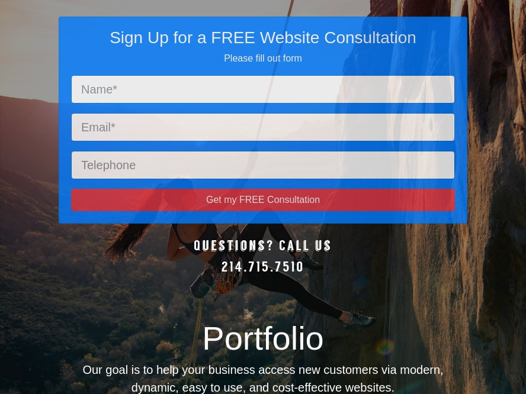

# Web Designer Contact Form Database

Click for a [Live Demo.](http://www.onegreatapp.com/web-designer-contact-form)

## Description
A contact form I used as my Google AdWords landing page. The visitors signs up and their information is stored in a database and notifies the owner via email.

## Installation
Use the **createdb.sql** file to create your database and table. Then inside the **private** directory create a **dbconfig.php** file with your database credentials.  

## Technologies
PHP, MySQL, Bootstrap 4 
